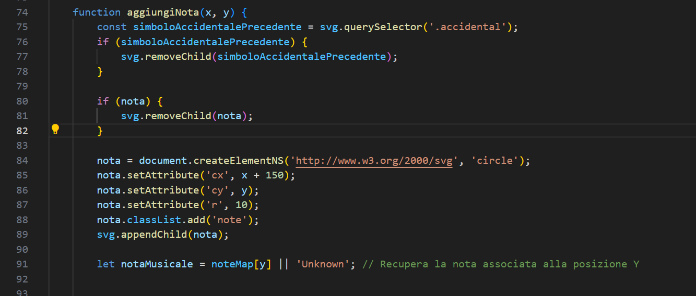
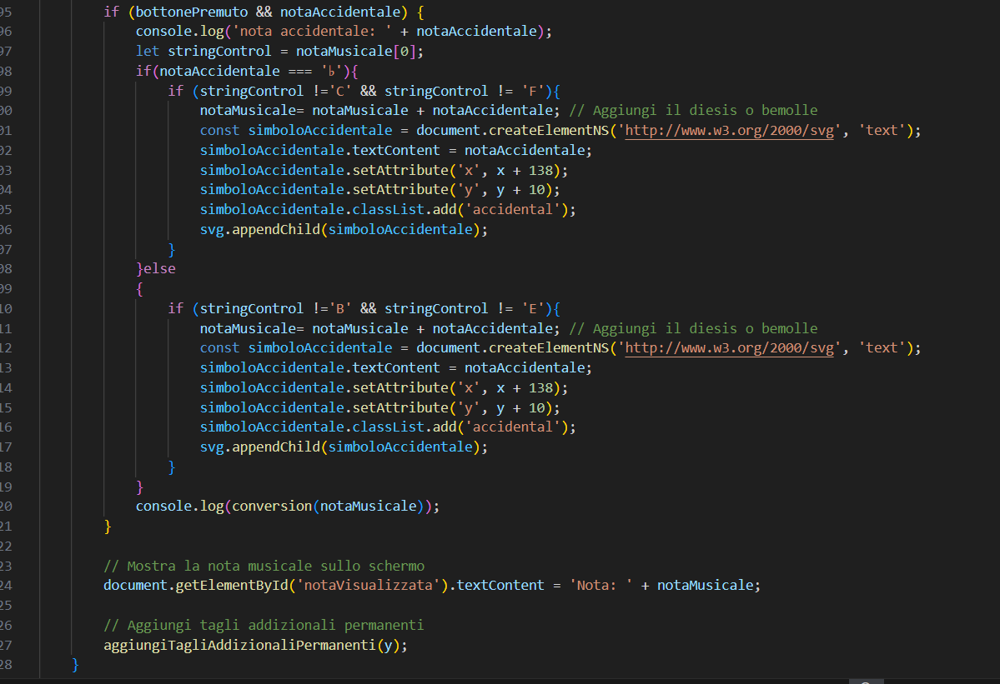
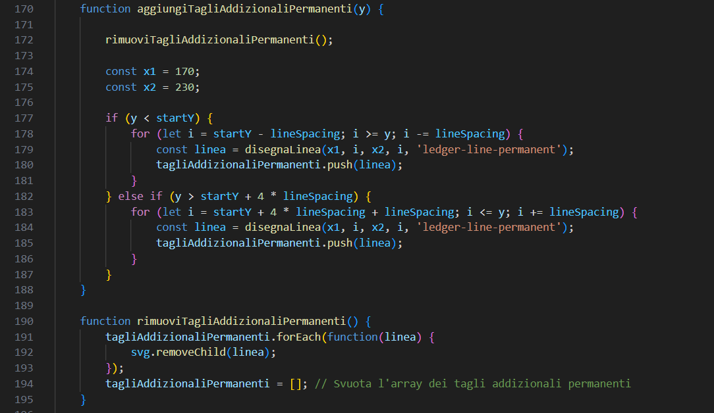
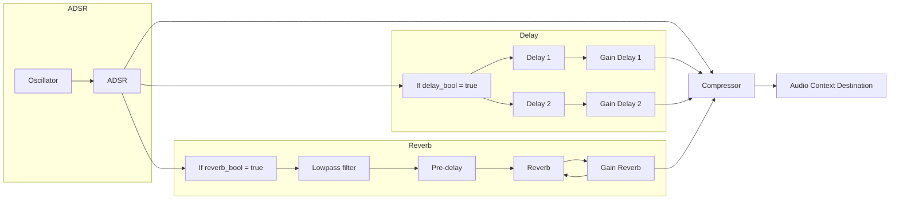
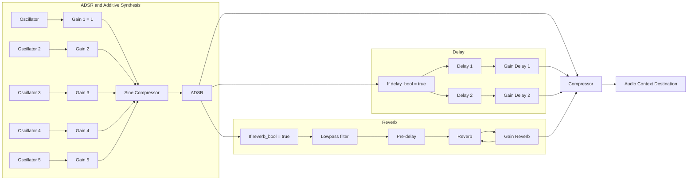

# Flute POS

## A Graphic Interface To Learn How To Play The Transverse Flute

If you are starting to approach the world of the transverse flute, whether self-taught or not, you're at the right place. 
May you be a self-taught musician and you want to learn the right positions of the instrument, or may you be an already trained flutist and often you've difficulty in remembering right positions, expecially for high octaves and trills, this website is designed for you.

This project is the result of a team work for the course _Advanced Coding Tools and Methodologies_ of the M.S. Degree _Music and Acoustic Engineering_ at Politecnico di Milano.

## How Can I Use It?

The graphic interface allows you to insert notes on the staff, giving you the possibility of choosing whether the note is altered or not and then the relative flute position will appear on the display. Moreover, it's also possible to listen the right sound of that note and verify if the note played by the flutist is correct or not, through a tuner connected to the microphone.

## Video DEMO

Here is a quick video tutorial:
METTERE VIDEO!
<video src="./Video_demo.mp4" controls title="Title"></video

Don't worry, anything shown in the video will be explained below in this page.

### Choosing the note 

The very first step to follow to use this website is to have the flute in hand and a lot of good will. 

The staff which will appear on the display will allow you to select the note whose position you want to know/remember. The reference adopted for the staff is the treble clef without any key signature: for this reason is therefore possible to choose if the note is altered or not by pressing, before the note, one of the two buttons respectively corresponding to sharp `#` or flat `b`.

It's also possibile to select notes below or above the staff, thanks to the ledger lines put as a reference while pointing with the mouse on the staff.

After this the note will appear on the staff.
Obviously it will be only possible to choose the notes that are within the range of the transverse flute, therefore from the `C3` to the `C6`.


### Looking at the position

Once you've selected the note on the staff, the relative position will appear on the flute picture put on the left side, in particular the keys to press will be seen in black.

Note that the keys to press with the thumb of the left hand, which are not visible in the view in which the flute has been drawn, are positioned detached from the body of the flute, in correspondence of its real position.

And that's it!
You're done!
Now it's time to play!
### Can I listen to the right position sound?
Yes. As you can see, there is a radio positioned in the top right and by pressing it you will hear the correct sound.
### How can I verify if the note I'm playing is correct?
It's also possible to verify the correct execution of the note by using the `Tuner` box positioned in the bottom right corner. It requires the access to the microphone and then you can check also the tuning of the sound.
### What about trills?
The trill is a musical ornament consisting of a rapid alternation between two adjacent notes, usually a semitone or tone apart. 

On this website a beginner flute can also learn how to play them. 

The steps to follow are very similar to those of the single note positions. After you've selected the note on the staff you can also select the type of trill to play. For each note it's possible to choose between four different trills in the `TRILLS` box: one for a semitone above (`SUP1`), one for a tone above (`SUP2`), one for a semitone below (`INF1`) and one for a tone below (`INF2`).
The flute picture will show the fixed keys to press in black as usual, while the key which will be moved for the execution of the trill will appear colored in red.
### Can I see the trill positions for all the notes?
Not all the notes allow the execution of trills, this depends on the range of the flute: for instance for the `C3`, which is the lowest note for a transverse flute, it's only possible to execute the two upper trills. For this reason, for the notes that are at the edges of the flute range, not all the trill buttons can be pressed.
### Can I also check the correct execution of the trills?
You can obviously listen to the correct execution of each trill, by pressing the radio as for single notes, but it's not possible to use the `Tuner` box, as it works only for one note at time, since you will be playing more than one note simultaneously.
### Is There Anything Else It Can Do?

> It ain't much, but it's honest work.


## PENTACAZZI

### Functions `aggiungiNota`

The aggiungiNota function is designed to add a musical note representation to an SVG element at a specified position. 

This function handles the rendering of a note on a musical staff, ensuring that any previous accidental symbols or notes are removed before adding the new note.



#### Parameters and description

Parameters:

- x (Number) -> The x-coordinate for the position where the note will be placed on the SVG element.
- y (Number) -> The y-coordinate for the position where the note will be placed on the SVG element.

Descriptions:

The function starts by checking if there are any existing accidental symbols (like sharps or flats) represented by elements with the class accidental within the SVG. If found, it removes them.
It also checks if there is an existing note (nota) and removes it to ensure that only the most recent note is displayed.

A new SVG circle element is created to represent the musical note.

The cx attribute (x-coordinate) is set to x + 150, which positions the note 150 units to the right of the provided x coordinate.

The cy attribute (y-coordinate) is set to y, positioning the note at the provided y-coordinate.

The r attribute is set to 10, giving the note a radius of 10 units.

The newly created note element is appended to the SVG element.

The variable notaMusicale is assigned the musical note corresponding to the y-coordinate from the noteMap object. 

### Handling accidental notes

This section of the code is responsible for handling accidental notes (sharps and flats) when a button is pressed `(bottonePremuto)` and an accidental note `(notaAccidentale)` is specified. It updates the musical note with the accidental and displays it on the SVG element.



#### Description

The condition if (bottonePremuto && notaAccidentale) checks if the button is pressed and an accidental note (either sharp or flat) is specified.
let stringControl = notaMusicale[0]; extracts the first character of the musical note, representing the base note.

If the accidental note is a flat (♭) and the base note is not 'C' or 'F', the flat is added to the musical note.

If the accidental note is a sharp (♯) and the base note is not 'B' or 'E', the sharp is added to the musical note.

document.getElementById('notaVisualizzata').textContent = 'Nota: ' + notaMusicale; updates the text content of an HTML element with the ID notaVisualizzata to display the current musical note.

aggiungiTagliAddizionaliPermanenti(y); calls a function to add permanent ledger lines to the musical staff, ensuring the note is properly displayed on the staff.

### Hanlding ledger lines

This part of the script is responsible for adding and removing permanent ledger lines to the musical staff based on the provided y-coordinate. It ensures that additional ledger lines are added or removed dynamically to accommodate notes outside the standard staff range.



#### Description

The function first calls rimuoviTagliAddizionaliPermanenti() to remove any existing permanent ledger lines from the SVG.

Constants x1 and x2 define the starting and ending x-coordinates for the ledger lines.
If the provided y-coordinate (y) is below the starting y-coordinate of the staff (startY), additional ledger lines are added above the staff to accommodate lower notes.

If the provided y-coordinate is above the upper limit of the staff (beyond 4 times the line spacing), additional ledger lines are added below the staff to accommodate higher notes.

This function iterates over each permanent ledger line in the tagliAddizionaliPermanenti array and removes them from the SVG element.

After removing all lines, the tagliAddizionaliPermanenti array is cleared, ensuring it's ready for new lines to be added.


## How Does It Work?
### Block diagram

This project is composed of one HTML file, one CSS file and four JavaScript files:

* `Script_accordatore.js`: is the management of the tuner.
* `Script.js`: is the management of the staff.
* `Script_agg_aprile.js`: è lo script principale che collega posizioni e suoni.
* `yin.js`: it is a library used for fundamental frequency recognition.

### Music Description 

Basically, when the user adds a note in the sequence to be played, a `note` object is created as:

``` JavaScript
note = {
    letter: letter,
    octave: octave,
    alteration: alteration,
    duration: duration,
    start_index: start_index
}
```

And it is pushed into the `sequence` array of notes.
Consider that each note has a tatum-wise reference `start_index` for the grid which indicates when the note will be played, so the order of the notes inside the sequence is irrelevant.

In order to play the sequence, each note is translated in a `data` object as:

``` JavaScript
data = {
    frequency: f,
    duration_ms: ms,
    time: start
}
```

This is when BPM and tuning frequency are used: both `frequency` and `duration_ms` are the result of two functions that compute physical data from musical information.
Also `time_ms` is the milliseconds value of the `start_index` (which is in terms of 16th).

### Sound Chain and Audio Synthesis

Each of notes of `data` array will be passed to the `playNote` function to be played accordingly.\
The generic sound chain implemented inside this function is:



The properties of the note (`frequency` and `duration_ms`) are used as it follow:

``` JavaScript
function playNote(note) {
    /*
    This function requires a note object
    It plays a single note
    */

    // Definition of note's oscillator
    let o = c.createOscillator();
    o.frequency.value = note.frequency;     // <---
    o.type = wave_type;
    
    // ...
    
    // Envelope shaping
    g_adsr.gain.setValueAtTime(0, c.currentTime);
    g_adsr.gain.linearRampToValueAtTime(1, c.currentTime + attack);
    g_adsr.gain.linearRampToValueAtTime(1, c.currentTime + note.duration_ms / 1000 - release);      // <---
    g_adsr.gain.linearRampToValueAtTime(0, c.currentTime + note.duration_ms / 1000);        // <---
    
    // ...

    // Playing the oscillator
    o.start();
    // Scheduling the oscillator stop
    setTimeout(() => o.stop(), c.currentTime + note.duration_ms);       // <---

    // ...
}
```

When the selected waveform is `"sine"`, a slightly different version is employed:




The difference is that now an additive-synthesis technique has been developed, in order to make the sound of the single oscillator more interesting and appealing.\
Additive synthesis is a technique that uses the superposition of different sine waves.
In this case, the four added oscillators have frequencies of the first partials of the note: it means that each oscillator plays a multiple of the note's frequency. So, oscillator `2` plays `2 * note.frequency`, oscilator `3` plays `3 * note.frequency` and so on.
Only exception is oscillator `5` that plays `0.5 * note.frequency`, which is not an harmonic but a sub-harmonic.

### Layout Design

In the course of this project development, various layout models were implemented.
The final version depicts the most intuitive layout, with the greatest visual impact.\
The layout is the result of two files written in HTML and CSS (respectively `GUI.html` and `Style.css`).\
Using HTML, it is possible to describe the layouts from an structural point of view, in terms of visual representation: the graphic parts, such as buttons and LEDs, were placed within `div` elements that could emphasise their own space within the interface.\
In addition, each button was identified by a precise `id` (useful for positioning them within the webpage and for linking them to specific `onclick` functions present in the JavaScript file `Buttons_functions.js`), and by a `class`, where the latter differentiates the different categories of buttons (e.g. whether they are durations or alterations).\
As regards of the grid and the keyboard, a `canvas` object has been used: the reason for this choice is dictated by its incredible flexibility and adaptability, which is specifically relevant for modifying the sequence directly from the grid and with the simple use of the mouse.\
Furthermore, it can be seen how the use of colours makes the whole webpage more interesting, and with a marked harmonisation between `div` and `button` elements.\
CSS provided the opportunity to work from a purely graphical point of view, with the choice of dimensions, contours, actual positioning and colours of the various elements.
The focus was to have the most compact graphics possible, as well as a clear and intuitive interface, to be easily used during the composition of the sequence.\
It is important to emphasise, for the reasons mentioned above, how some `label` elements were inserted precisely to make it easier to use and free of misunderstandings.

### Grid Representation

At the beginning, both the grid and the keyboard are drawn by `drawGrid` and `drawKeyboard` functions, called together by `clearAndDrawCanvas` function, which clears and draws again the canvas.\
After that, whenever a `note` objects is defined and added in the `sequence`, it is drawn in the grid by `drawNoteInGrid` function, which uses the note's musical information to do so (without BPM and tuning frequency).

When the user loads a sequence from a text file, the `drawSequenceInGrid` function reads the sequence and calls `drawNoteInGrid` for each element of the array.

### Notes Implementation Through The Grid

In order to allow the user to add notes through the grid, several considerations were taken into account.\
Each cell (along the y axis) is related to a pitch, depending on the chosen octave range.
Each cell (along the x axis) is related to the tatum (in this case 16th).\
When clicking on a cell, the code will check if the note is still available. If the note is already present in that moment, an alert will pop up and the user will have to click elsewhere.
Checking the notes availability is easily done by creating a mirror grid (`2d-array`) filled with boolean values: `True` means that the cell is available, `False` means the opposite.\
When loading the sequence for the first time, the `mirror_grid` is initialised with `True` everywhere (because the grid is empty).\
When a note is effectively added to the sequence (with a double click), the `mirror_grid` will be updated: the elements corresponding to the note attributes (pitch, duration and starting time instant) will be changed to `False`.\
When loading a sequence (through the `Load Melody` button), the `mirror_grid` is updated in the same way.\
When clearing the sequence, the code initialises the `mirror_grid` again.\
The mirror grid update also happens when we add notes using the buttons.

### Files Management

In order to save the written sequences into the user's computer, we used a method where we create a temporary link into the webpage.\
A window prompt asks to enter the file's name.
Once it's done, a link is created into the webpage and filled with a `Blob` object containing the sequence (passed as a `string`).\
Then, the code automatically downloads this file with a `.txt` format into the user's computer.
Finally, the link is immediately removed.

In order to load a written sequence, we used the `FileReader` object from the File System API of JavaScript.\
When we click on the `load file` button, a `file selector` window immediately appears on the screen, allowing only `.txt` files.\
Once the file is selected, its content is loaded as text into an `output` element of the webpage.\
The sequence is updated accordingly to the content of this `output` element, after converting it into an `object`.
In the end, the `mirror_grid` is updated to match the new sequence and the code draws it into the grid.

## Challenges Encountered

### Di Lorenzo

The main difficulty I had during the development of this project was to find the best melody and note architecture in order to implement the features we had in mind.\
At first, the code allowed to play only singular-note melodies, then we added chords (but only with the same duration for all notes).\
So, in order to allow the user to add notes of any duration in any time position, I implemented a midi-like representation with the use of a starting time instant (both in tatum-wise terms and in milliseconds).\
Finally, to make the sequence computation time lower, the code I wrote creates a `sorted_data` array and use the recursive calling logic to schedule the next note to be played.
In `sorted_data` all the notes of the melody are sorted by starting time reference (from first to last notes) and all simultaneous notes are clustered together (notes that start at the same time constitutes a multiple-elements array inside `sorted_data`).

Regarding the resulting sounds, the sound quality was another challenge I wanted to deal with.\
The use of low-level functionalities and elements allowed us to write faster code, but didn't lead to very pleasant sounds.
So I tried to develop a more intricate sound processing chain, including compressors, delay and reverb, and tried to resemble a professional-like sound synthesis by using an additive synthesis technique instead of using a single oscillators.

### Mugnaini

From the point of view of the layout, I believe that the most significant challenge found was to represent and position all the elements in a coherent way with the idea proposed initially.
It was not easy above all to stack the different elements (buttons, leds...); this has brought various changes during the development but we can consider ourselves satisfied with the final version obtained.

### Ouali

My personal challenges dealt with JavaScript functionalities that weren't seen during lectures or just briefly discussed.\
The functionalities I struggled with were: `Blob` object, `FileReader` object and asynchronous functions.\
I managed to overcome the challenges related to `Blob` and `FileReader` objects with a lot of "die-and-retry" logic, YoutTube tutorials and with the help of code snippets delivered by ChatGPT. \
I must thank OpenAI for developing ChatGPT as it was a great tool to quickly obtain code snippets, showing basic uses and writing rules for those functionalities.\
They allowed me to quickly grasp an idea of how to handle and declare such tools, which eventually saved me a lot of time.
I was also able to save a lot of time thanks to the AI Copilot that we were shown during the lectures.
It helped me remember variables, specifities of our program...
It is a great tool that I'll keep using throughout my life.\
However, I must say that extra carefulness is required when using such tools as errors are frequent. 
Using them should never undermine the developer's mind and our thirst of "Do It Yourself".
Instead, they should be considered as sidekicks, helping us facing logic issues or tough challenges.

## Credits

### Di Lorenzo

I found this project development as an opportunity to put myself on the line (it was my very first serious coding project) and to start learning important soft skills, imposing myself to create a work-like professional workflow.
This process was easily simplified by working with my colleagues Nicola and Ernest, because we all managed to create a balanced, organized and enthusiastic work environment, hopefully leading to other chances of working together.

### Mugnaini

At the conclusion of this project, I would like to thank my colleagues Giuliano and Ernest for the professionalism, dedication and commitment they showed and for conveying a part of themselves within each hour spent at work.\
It is not easy to find people who are so close to one's ideas and for this reason I consider myself very lucky.\
Moreover, this work has given us the opportunity to establish a friendship beyond the working relationship, for which I am extremely grateful.

### Ouali

My biggest pride, even if I had no particuliarly tough challenge implementing it, was developing the grid interaction for our sequence.
Coding it felt like a game, such as debugging.
I really had a great time turning my ideas into working code.\
Moreover, I deeply appreciated working with Giuliano and Nicola.
Thanks to this project, I was able to know them better and a great friendship was born from this project.
I highly consider their seriousness and rigor.
We had a lot of meeting for this project, starting mid-October until the end of December.
We were extremely well organised as Giuliano's milestone checklist really helped us prioritizing features implementation.\
All of us were proactive on our group chat for checking the evolution of our project, showing that each one of us was extremely motivated for the project development.
In my academic experience, it is the first time that I got the chance to work with such reliable people.

---

Project developed by:
* Baldini Giovanni
* Cagnetta Angelica
* Panettieri Francesco
* Pelazza Marco
