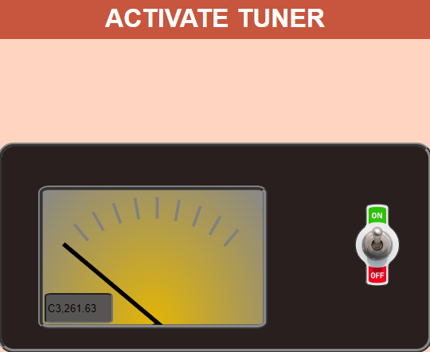

# THRILLIZY

## A Graphic Interface To Learn How To Play The Transverse Flute

If you are starting to approach the world of the transverse flute, whether self-taught or not, you're at the right place. 
May you be a self-taught musician and you want to learn the right positions of the instrument, or may you be an already trained flutist and often you've difficulty in remembering right positions, expecially for high octaves and trills, this website is designed for you.

This project is the result of a team work for the course _Advanced Coding Tools and Methodologies_ of the M.S. Degree _Music and Acoustic Engineering_ at Politecnico di Milano.

## How Can I Use It?

The graphic interface allows you to insert notes on the staff, giving you the possibility of choosing whether the note is altered or not and then the relative flute position will appear on the display. Moreover, it's also possible to listen the right sound of that note and verify if the note played by the flutist is correct or not, through a tuner connected to the microphone.

### Video DEMO

Here is a quick video tutorial:

<video <source src="videos/example.mp4" type="video/mp4"></video

Don't worry, anything shown in the video will be explained below in this page.

### Choosing the note 

The very first step to follow to use this website is to have the flute in hand and a lot of good will. 

On the right side, a reference diagram of the correct flute fingerings has been included.

The staff which will appear on the display will allow you to select the note whose position you want to know/remember. The reference adopted for the staff is the treble clef without any key signature: for this reason is therefore possible to choose if the note is altered or not by pressing, before the note, one of the two buttons respectively corresponding to sharp `♯` or flat `♭`.

It's also possibile to select notes below or above the staff, thanks to the ledger lines put as a reference while pointing with the mouse on the staff.

After this the note will appear on the staff.
Obviously it will be only possible to choose the notes that are within the range of the transverse flute, therefore from the `C3` to the `C6`.

### Looking at the position

Once you've selected the note on the staff, the relative position will appear on the flute picture put on the left side, in particular the keys to press will be seen in black.

Note that the keys to press with the thumb of the left hand, which are not visible in the view in which the flute has been drawn, are positioned detached from the body of the flute, in correspondence of its real position.

And that's it!
You're done!
Now it's time to play!
### Can I listen to the right position sound?
Yes. As you can see, there is a radio positioned in the top right and by pressing it you will hear the correct sound.

### How can I verify if the note I'm playing is correct?
It's also possible to verify the correct execution of the note by using the `Tuner` box positioned in the bottom right corner. It requires the access to the microphone and then you can check also the tuning of the sound.

### What about trills?
The trill is a musical ornament consisting of a rapid alternation between two adjacent notes, usually a semitone or tone apart. 

On this website a beginner flute can also learn how to play them. 

The steps to follow are very similar to those of the single note positions. After you've selected the note on the staff you can also select the type of trill to play. For each note it's possible to choose between four different trills in the `TRILLS` box: one for a semitone above (`SUP1`), one for a tone above (`SUP2`), one for a semitone below (`INF1`) and one for a tone below (`INF2`).

The flute picture will show the fixed keys to press in black as usual, while the key which will be moved for the execution of the trill will appear colored in red.

### Can I see the trill positions for all the notes?
Not all the notes allow the execution of trills, this depends on the range of the flute: for instance for the `C3`, which is the lowest note for a transverse flute, it's only possible to execute the two upper trills. For this reason, for the notes that are at the edges of the flute range, not all the trill buttons can be pressed.

### Can I also check the correct execution of the trills?
You can obviously listen to the correct execution of each trill, by pressing the radio as for single notes, but it's not possible to use the `Tuner` box, as it works only for one note at time, since you will be playing more than one note simultaneously.
### Is There Anything Else It Can Do?

> It ain't much, but it's honest work.

## How Does It Work?
### Block diagram

This project is composed of one HTML file (`index.html`), one CSS file (`style.css`), four JavaScript files and some images:

* `tuner.js`: is the management of the tuner.
* `staff.js`: is the management of the staff.
* `positions.js`: è lo script principale che collega posizioni e suoni.
* `yin.js`: it is a library used for fundamental frequency recognition.

### Overall workflow

the process starts by selecting a note from the staff in the interval C3-C6 for a total of 37 options. This selection occours in the staff.js file and it generates a string containing the name of the note selected of the type'note'+'octave'+'accidental' (e.g. 'E5b'). This string is then used by the startProcessing function in the position.js in order to produce the correct index of the selected note in the list of the whole notes. It now activate the run function (taking as input also the thrills states) which sets the correct keys combination on the flute by a 15-element vector and calls the playAudio function with the string identifier of the .wav file that will be loaded. This very same index is then used in the tuner.js by the initAudioContext function which starts the media stream and sets the reference frequency of the tuner which will be activated only if none of the thrills is selected (otherwise it will not be working).
If any of the thrills is selected the isThrill variable is true and the 15 elements vector must be modified with the alterated position of the fixed keys (set to 1) and the moving keys (set to 2) which will be displayed in red.

## positions.js

### Class: `Position`
The `Position` class represents a musical position, containing information about the note, the frets involved, and a numerical identifier. 

It's equipped by a constructor which initialises 3 attributes:
* `getNote`: Returns the note associated with the position.
* `getFrets`: Returns the frets associated with the position.
* `getNumber`: Returns the numerical identifier of the position.

For each attribute `Getter` methods are created. The `getBinaryFrets()` returns the keys of the associated position in binary:
* 0: not pressed key
* 1: pressed key

The `Position` class encapsulates the concept of a musical position, providing methods to access and manipulate the note, frets, and associated numerical identifier. The class also offers functionality to convert the frets into a binary format and print detailed information about the position.

### Class: `ThrillsOfNote`
The `ThrillsOfNote` class represents the thrills associated with a musical note, containing information about various fret positions and their corresponding notes.

It's initialized by the constructor with the following attributes:
* `this.position`: it's an object of the `Position` class of the corresponding note
* `this.dict`: it's the trills `JSON` which is a kind of database that contains all the information about the trills

The `getThrills()` method returns the complete trill.

The `positionAlterationManager()` method manages the eventual alterations of the corresponding trill position.

### Const: `position`
This constant is an array of arrays which contains all the notes positions
### Const: `th`
This is an `JSON` which contains all the information about trills.
### Function: `run`

The `run` function determines whether to display a thrill or a single note based on the `isthrill` parameter. If it is true, it find the correct thrill based on the specified superior (`sup1`, `sup2`) or inferior (`inf1`, `inf2`) flags. Otherwise, it find the single corresponding note.

When the function `run(index,isThrill, sup1, sup2, inf1, inf2)` is runned there are two possible results:
* `isThrill===True` ==> returns the trill
* `isThrill===False`==> returns the corresponding single note position

### Function: `choose`

The `choose` function updates the state of thrill selection, toggles the thrill mode, and updates the background color of the related buttons. It then calls the `run` function to return the selected note or thrill and starts or stops the tuner based on the current state.

 
## tuner.js

### Function: `initAudioContext`

The `initAudioContext` function initializes the audio context and sets up microphone input with filtering and analysis capabilities.

It requests access to the user's microphone using `navigator.mediaDevices.getUserMedia`.
Upon successful permission, it initializes the microphone as a media stream source.

A low-pass filter is created using `createBiquadFilter`, and its type is set to `lowpass`.
The filter's frequency is set to 1000 Hz. This kind of lowpass is used to cancel some noise in the highest frequencies, the cutt-off frequency is placed at the end of the extesion of the flute.

An analyser node is created using `createAnalyser`.
Its FFT size is set to `8192` for frequency analysis, and minimum decibels are set to `-90`.

The microphone input is connected to the low-pass filter, and the filter is connected to the analyser.

### Function: `getFrequency`

The `getFrequency` function is responsible for retrieving the frequency data from the microphone input and performing real-time frequency analysis to determine the current pitch. It then updates the UI elements based on the detected pitch.

The function first checks if setTuner is true before proceeding with frequency analysis.
It retrieves frequency data from the microphone input using `analyser.getFloatTimeDomainData`.

Frequency is calculated using the `window.yin()` function with the frequency data and the sample rate of the audio context. This function comes from thelibrary yin.js (https://github.com/adriano-di-giovanni/yinjs)

`const frequencyToNoteDB` ==> This array is a correspondence table between frequencies and musical notes. Each element of the array is a sub-array containing the name of the note and its corresponding frequency in hertz.

### Function: `handleNoteDifferences`

The `handleNoteDifferences` function calculates the difference between the detected frequency and the target note, determining whether the detected frequency is lower or higher than the target note and computing the difference in cents accordingly.

The function determines the notes before and after the target note based on its index in the `frequencyToNoteDB` array.
Based on the comparison between the detected frequency and the neighboring notes, the function determines whether the detected frequency is lower or higher than the target note.

The function returns an array containing the cent difference and the state string ('LOW' or 'HIGH') that indicates if the detected frequency is higher or lower than the refereence one.

### Function: `stopAudioContext`

The `stopAudioContext` function is responsible for stopping the audio context, clearing the frequency interval, and releasing any active media streams associated with microphone input.

## staff.js
### Function `aggiungiNota`

The `aggiungiNota` function is designed to add a musical note representation to an SVG element at a specified position. 

This function handles the rendering of a note on a musical staff, ensuring that any previous accidental symbols or notes are removed before adding the new note.

The function starts by checking if there are any existing accidental symbols (like sharps or flats) represented by elements with the class accidental within the SVG. If found, it removes them.
It also checks if there is an existing note (nota) and removes it to ensure that only the most recent note is displayed.
- The `cx` attribute (x-coordinate) is set to x + 150, which positions the note 150 units to the right of the provided x coordinate.
- The `cy` attribute (y-coordinate) is set to y, positioning the note at the provided y-coordinate.
- The `r` attribute is set to 10, giving the note a radius of 10 units.

The newly created note element is appended to the SVG element and the variable `notaMusicale` is assigned the musical note corresponding to the y-coordinate from the `noteMap` object. 

### Handling accidental notes

This section of the code is responsible for handling accidental notes (sharps and flats) when a button is pressed (`bottonePremuto`) and an accidental note (`notaAccidentale`) is specified. It updates the musical note with the accidental and displays it on the SVG element.

The condition `if (bottonePremuto && notaAccidentale)` checks if the button is pressed and an accidental note (either sharp or flat) is specified.

`let stringControl = notaMusicale[0];` extracts the first character of the musical note, representing the base note.

If the accidental note is a flat (♭) and the base note is not 'C' or 'F', the flat is added to the musical note.

If the accidental note is a sharp (♯) and the base note is not 'B' or 'E', the sharp is added to the musical note.

`document.getElementById('notaVisualizzata').textContent = 'Nota: ' + notaMusicale;` updates the text content of an HTML element with the ID notaVisualizzata to display the current musical note.

`aggiungiTagliAddizionaliPermanenti(y);` calls a function to add permanent ledger lines to the musical staff, ensuring the note is properly displayed on the staff.

### Hanlding ledger lines

This part of the script is responsible for adding and removing permanent ledger lines to the musical staff based on the provided y-coordinate. It ensures that additional ledger lines are added or removed dynamically to accommodate notes outside the standard staff range.

The function first calls `rimuoviTagliAddizionaliPermanenti()` to remove any existing permanent ledger lines from the SVG.

Constants x1 and x2 define the starting and ending x-coordinates for the ledger lines.
If the provided y-coordinate (`y`) is below the starting y-coordinate of the staff (`startY`), additional ledger lines are added above the staff to accommodate lower notes.

If the provided y-coordinate is above the upper limit of the staff (beyond 4 times the line spacing), additional ledger lines are added below the staff to accommodate higher notes.

This function iterates over each permanent ledger line in the `tagliAddizionaliPermanenti` array and removes them from the SVG element.

After removing all lines, the `tagliAddizionaliPermanenti` array is cleared, ensuring it's ready for new lines to be added.

### Function `conversion`

The `conversion` function is responsible for converting a given musical note to its enharmonic equivalent, considering any sharps or flats present in the note. It utilizes a predefined array of musical notes (`noteArray`) for reference.

The function initializes the conversion variable with the input `notaMusicale`, assuming no conversion is needed initially.
It extracts the first two characters of the input note and stores it in the `str` variable.

If the input note contains a sharp (♯), it iterates over the `noteArray` to find the corresponding note.

When a match is found, it assigns the enharmonic equivalent note with a flat (♭) to the conversion variable.
The loop breaks as soon as a match is found.

If the input note contains a flat (♭), it directly assigns the input note with a flat (♭) to the conversion variable.

The function returns the converted note.

### Layout Design

The layout of this webpage is based on the `css` Grid Layout module in order to divide the page into 6 major regions and define the content position in relative coordinates inside any of them. Items aligment is particularly important in the flute region (defined by the class id `fluteContainer`) which specificately leans on the correct overlap between each key (on the flute image) and the `svg` elements drawn on top of it. Each of the 15 elements is realized point by point as an `svg` circle or path in order to simulate the color change of the activated key by recalling its id name in the `positions.js`. Circles are easy to draw in `svg`, you only need to provide the (x,y) coordinates and the radius desired, while paths are more complex beacuse the only way is to proceed by trials and errors trying to follow contours the best. The background color of these elements will be modified by the last few lines of the `run` function in `positions.js`, by recalling each element by its id name and acting on its style attribute.\
The `trilli` and `containerAccordatore` items, positioned in the two lower cells of the grid, are tables in turn in order to simply display their content in the correct position.\
Buttons are all defined with the same style in `css` and have multiple states: `on`, `off` and eventually `deactivated`. Background color, border color and border style are all modified by `pressButton` and `deactivateButton` functions when toggling.
Concerning the aesthetic aspect we looked for a nice color palette on `coolors.co` and anyway the front end changed many times in order to accomplish the best space organization and aspect also "playing" with gradients and texture pictures.

## Challenges Encountered

### Baldini
One of the difficulties I found in the developement was the correct managing of the tuner activation which needs to be refreshed by the selection of a new note, deactivated/activated by the selection of any of the thrills buttons or by its own on/off control, reinitializing averytime the audio-context in order to avoid errors in the frequency detection.
Other challenge was for sure the realization of the svg keys of the flute, the moving meter of the tuner controlled by the frequency error detected, and the averall organization of the page that required a lot of cooperation by the whole team. We tried to make a front end fully responsive to the screen size but in the last days it was providing many issues due to the large number of elements contained in the page so we opted for a full screen visualization only in order to be tidier.

### Cagnetta

From my point of view, the most complicated task was encoding in binary code all the positions of the individual notes and for each note the various trills. The positions shown were chosen to provide all possible options for alternate fingerings for those learning to play the flute. 

Another challenge was recording all the sounds and trills with perfectly tuned pitch, so that users would have a reliable reference to guide their practice, in fact not all the trills executions have been recordered, since we didn't have the appropriate equipment.

### Panettieri

I believe the most complex part encountered during the implementation of the staff was the creation of the additional ledger lines. I had never attempted anything like this before, so I had to study the range limits since the flute is an instrument that spans from C3 to C6, and develop our staff accordingly. 

Another complicated part was the linking and communication to ensure that the note entered was read correctly between the staff and the other components of the project.

### Pelazza
In the project, I encountered many challenging situations. The implementation of managing the thrill positions and handling all their alterations was really difficult. Additionally, putting everything together into a working pipeline was quite a challenge.

## Credits

### Baldini
I have to say thanks to the whole team for the dedication given to this project, it's been enriching for the skills we could develop together during our long-lasting meetings, fixing problems, discussing subsequent improvement step by stem has let any of us a foundamental brick of this work which is even just for this a really satisfying result.

### Cagnetta

I am truly satisfied with the final result of this project. It stemmed from a need that I encountered on several occasions during my studies as a flutist, and the fact that I can offer this project as an opportunity to future flutists makes me very proud. 

I am extremely grateful to my team, who believed in this idea from the very beginning and without whom this project would never have been realized.

Thank you for all the late-night study sessions, dinners, discussions, and suggestions for mutual improvement. It has been a pleasure working with you, and I hope this will be the first of many projects we develop together.
### Panettieri

In general, throughout my studies, I have done few group works to develop a project. Undoubtedly, this is the one in which I felt most comfortable.

It was certainly not easy; there were moments of difficulty, but all were overcome with a smile during pleasant work sessions, and in the end the goal was achieved, all thanks to my colleagues.

### Pelazza
I'm quite happy of the final work even if some modification and improvements are still available. The thing that I appreciated the most was working with my collegues in an pleasent and funny atmosphere. Working in such an environment helped me a lot to enjoy the project.

---

Project developed by:
* Baldini Giovanni
* Cagnetta Angelica
* Panettieri Francesco
* Pelazza Marco
